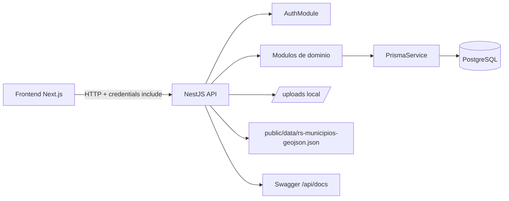
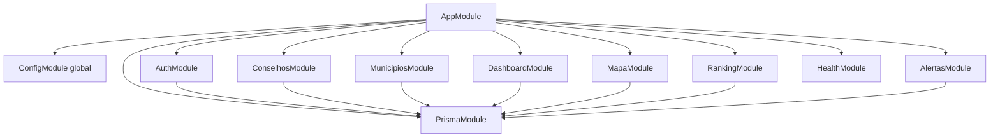
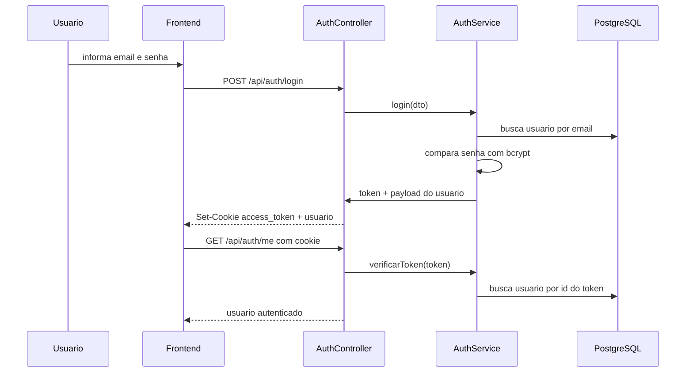
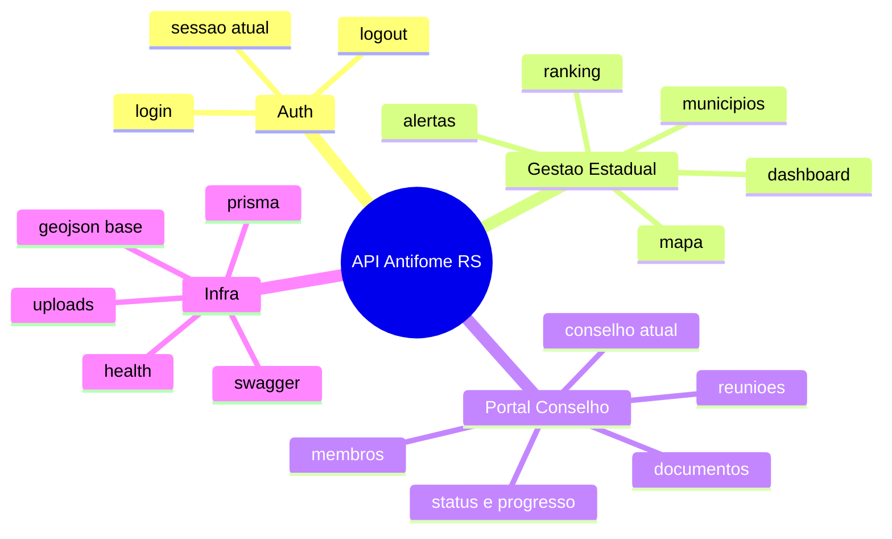

# Plataforma Antifome RS — Arquitetura da API

**Version:** 1.1.0  
**Last Updated:** 15/03/2026  
**Status:** Implementação atual do backend NestJS

---

## Visão Executiva

A API do Antifome RS é um backend NestJS modular, com persistência em PostgreSQL via Prisma e autenticação baseada em JWT armazenado em cookie HTTP-only.

O comportamento real hoje é:

- Base URL: `http://localhost:3001/api`
- Documentação Swagger: `http://localhost:3001/api/docs`
- Health check: `GET /api/health`
- Prefixo global: `api`
- Sessão: cookie `access_token`
- Banco: PostgreSQL via `@prisma/adapter-pg`
- Upload local: arquivos servidos em `/api/uploads/*`

---

## Stack da API

| Camada | Tecnologia | Papel |
|---|---|---|
| Runtime | Node.js | execução do NestJS |
| Framework | NestJS 10 | módulos, controllers, services, guards |
| ORM | Prisma | acesso type-safe ao PostgreSQL |
| Adapter DB | `@prisma/adapter-pg` | conexão Prisma sobre driver PG |
| Banco | PostgreSQL | persistência principal |
| Auth | JWT + cookie HTTP-only | autenticação e sessão |
| Hash de senha | `bcryptjs` / `bcrypt` | validação e seed |
| Docs | Swagger | catálogo visual dos endpoints |
| Segurança HTTP | `helmet` | hardening de headers |
| Compressão | `compression` | respostas comprimidas |
| Upload local | `multer` + `express.static` | armazenamento e exposição de documentos |

---

## Contexto da API

---

## Bootstrap e Pipeline HTTP

O bootstrap em [main.ts](/home/mestredoblack/teste/backend/src/main.ts) segue esta ordem:

1. Cria a aplicação Nest.
2. Ativa `helmet`.
3. Ativa `compression`.
4. Habilita CORS com allowlist local:
   - `http://localhost:3000`
   - `http://localhost:3001`
   - `http://localhost:3002`
5. Ativa `ValidationPipe` global com:
   - `whitelist: true`
   - `forbidNonWhitelisted: true`
   - `transform: true`
6. Define prefixo global `api`.
7. Garante a pasta `uploads/`.
8. Expõe arquivos em `/api/uploads`.
9. Publica Swagger em `/api/docs`.
10. Escuta a porta de `PORT` ou `3001`.

---

## Mapa de Módulos

---

## Módulos Implementados

| Módulo | Controller | Service | Papel |
|---|---|---|---|
| `AuthModule` | `auth.controller.ts` | `auth.service.ts` | login, logout, sessão atual |
| `MunicipiosModule` | `municipios.controller.ts` | `municipios.service.ts` | listagem, detalhe, histórico, índice |
| `ConselhosModule` | `conselhos.controller.ts` | `conselhos.service.ts` | portal do conselheiro, membros, reuniões, documentos, status |
| `DashboardModule` | `dashboard.controller.ts` | `dashboard.service.ts` | KPIs agregados do estado |
| `MapaModule` | `mapa.controller.ts` | `mapa.service.ts` | GeoJSON consolidado dos municípios |
| `RankingModule` | `ranking.controller.ts` | `ranking.service.ts` | ranking paginado de municípios |
| `AlertasModule` | `alertas.controller.ts` | `alertas.service.ts` | alertas de inatividade e quebra de silêncio |
| `HealthModule` | `health.controller.ts` | sem service | health check simples |

---

## Modelo de Segurança

### Como a autenticação funciona hoje

1. `POST /api/auth/login` valida email e senha.
2. A API assina um JWT com:
   - `sub`
   - `email`
   - `role`
   - `municipioId`
3. O token é armazenado no cookie HTTP-only `access_token`.
4. As rotas protegidas usam `JwtAuthGuard`.
5. O guard lê o cookie cru do header `cookie`, extrai `access_token` e valida o JWT.
6. O payload validado é anexado em `request.user`.

### Importante

- A autenticação real é por cookie, não por header `Authorization`.
- O Swagger anuncia `BearerAuth`, mas o código atual protege as rotas via cookie.
- Isso é um ponto de atenção para documentação pública e para clientes externos.

### Guard implementado

O guard em [jwt-auth.guard.ts](/home/mestredoblack/teste/backend/src/auth/jwt-auth.guard.ts) valida apenas:

- presença do cookie
- validade do token

Ele não implementa autorização por papel no backend. O controle de perfil está concentrado no frontend.

---

## Fluxo de autenticação

---

## Estratégia de acesso a dados

O [PrismaService](/home/mestredoblack/teste/backend/src/prisma/prisma.service.ts):

- estende `PrismaClient`
- cria conexão a partir de `DATABASE_URL`
- usa `PrismaPg` como adapter
- conecta no `onModuleInit`
- desconecta no `onModuleDestroy`

Isso centraliza o acesso ao banco para todos os módulos.

---

## Caching e otimizações

Há dois pontos de cache explícito:

| Serviço | Estratégia | TTL |
|---|---|---|
| `DashboardService` | cache em memória de KPIs | 5 minutos |
| `MapaService` | cache em memória do GeoJSON consolidado | 1 hora |

Além disso:

- `DashboardService` usa `Promise.all` para agregações em paralelo
- `RankingService` usa `findMany + count` em paralelo
- `MapaService` faz merge entre GeoJSON base e dados do banco

---

## Arquivos e artefatos locais

### GeoJSON base

- Arquivo: [backend/public/data/rs-municipios-geojson.json](/home/mestredoblack/teste/backend/public/data/rs-municipios-geojson.json)
- Consumido por `MapaService`
- Se não existir, o serviço cria features mock a partir de latitude/longitude

### Uploads

- Diretório físico: `backend/uploads/`
- Publicação HTTP: `/api/uploads/:filename`
- Upload atual usado pelo módulo de documentos do conselho

---

## Modelo de domínio da API

---

## Limites e observações arquiteturais

### O que está bem definido

- organização modular do backend
- acesso ao banco centralizado em Prisma
- fluxo de sessão simples para frontend web
- endpoints separados por domínio de negócio
- suporte a upload local e documentação Swagger

### O que merece evolução

- autorização por papel no backend ainda não está centralizada
- Swagger mostra bearer auth, mas a API real usa cookie
- ausência de DTOs formais na maior parte das rotas
- falta de camada de auditoria persistida
- uploads ainda sem armazenamento externo
- vários retornos de negócio são heurísticos ou simulados

---

## Referências de código

- Bootstrap: [main.ts](/home/mestredoblack/teste/backend/src/main.ts)
- Root module: [app.module.ts](/home/mestredoblack/teste/backend/src/app.module.ts)
- Auth: [auth.controller.ts](/home/mestredoblack/teste/backend/src/auth/auth.controller.ts)
- Guard: [jwt-auth.guard.ts](/home/mestredoblack/teste/backend/src/auth/jwt-auth.guard.ts)
- Prisma: [prisma.service.ts](/home/mestredoblack/teste/backend/src/prisma/prisma.service.ts)
- Schema: [schema.prisma](/home/mestredoblack/teste/backend/prisma/schema.prisma)
