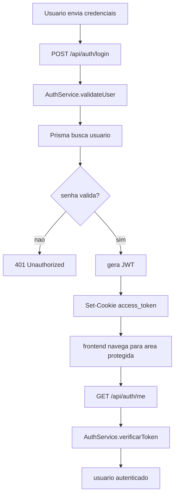
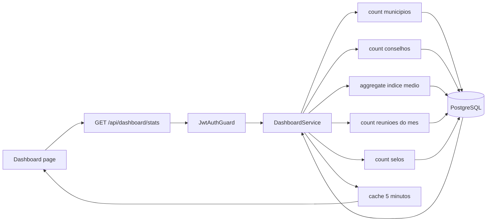
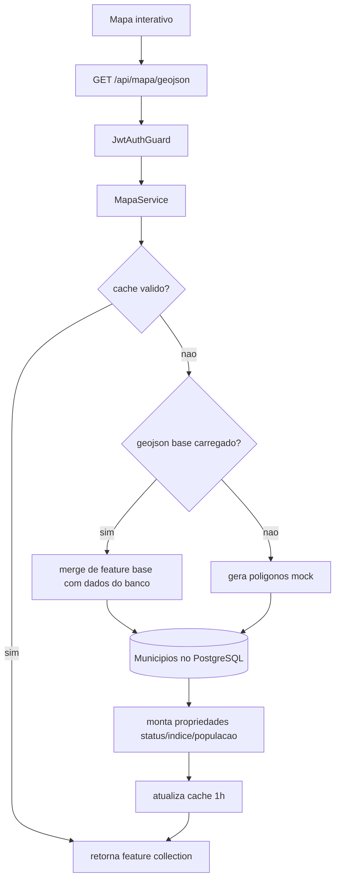
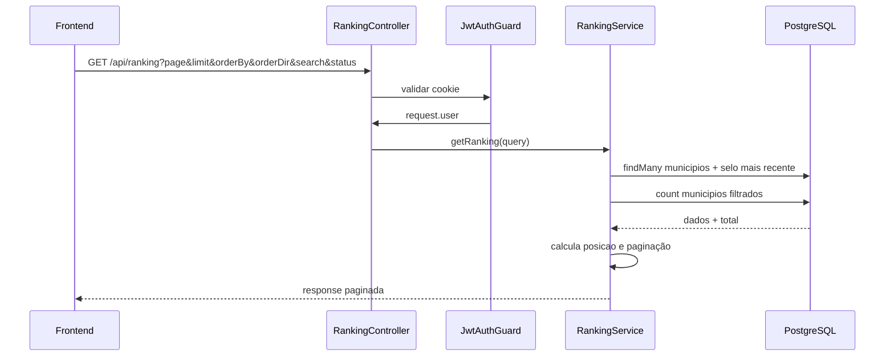
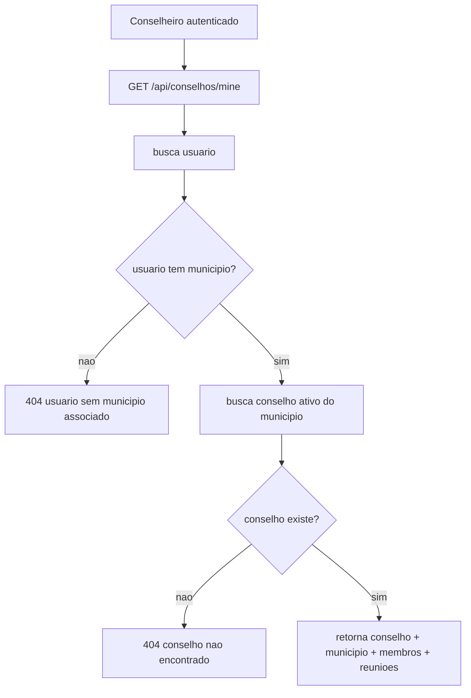
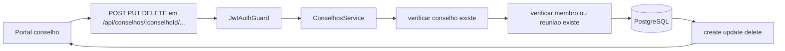
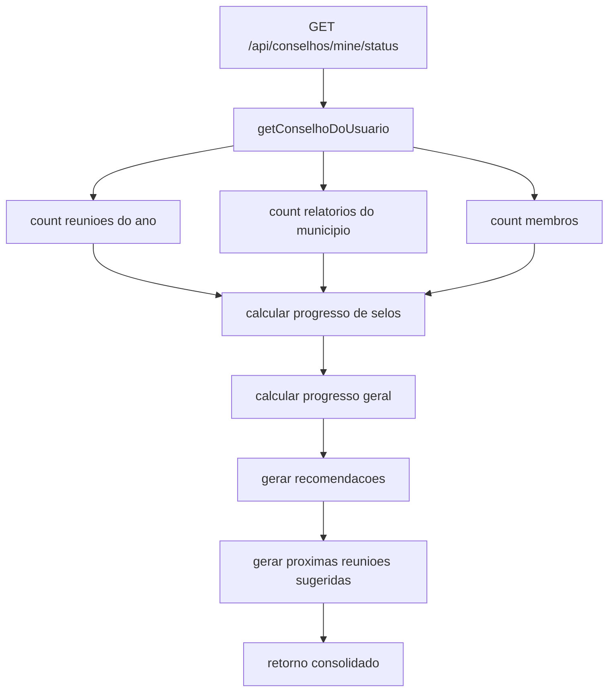
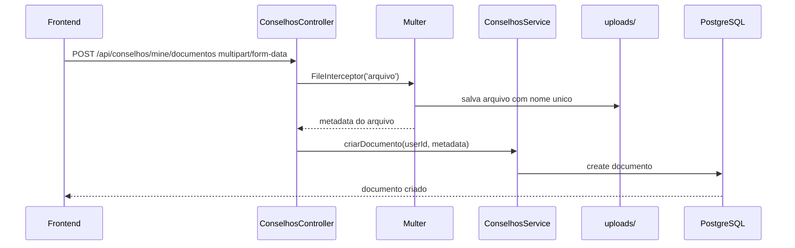
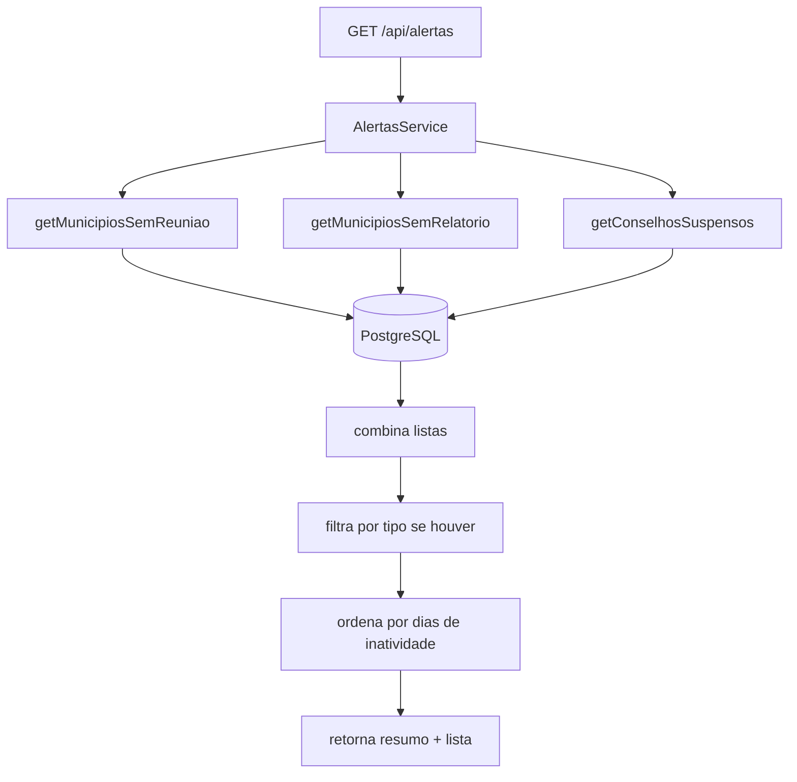
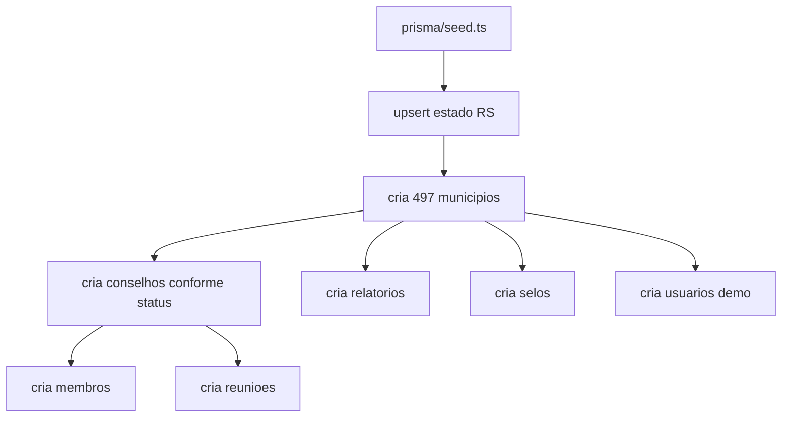

# Plataforma Antifome RS — Fluxos da API

**Version:** 1.1.0  
**Last Updated:** 15/03/2026

---

## Objetivo

Este documento descreve os fluxos operacionais mais importantes da API e como eles cruzam frontend, backend, autenticação, Prisma e PostgreSQL.

---

## Fluxo 1: Login e revalidação de sessão

### Observações

- O token não é devolvido como bearer token para consumo genérico.
- O fluxo assume cliente web com `credentials: "include"`.
- O frontend usa `/auth/me` para reconstruir sessão.

---

## Fluxo 2: Dashboard estadual

### Saída principal

- total de municípios
- municípios por status
- índice médio antifome
- total de conselhos
- reuniões do mês
- total de selos

---

## Fluxo 3: Geração do GeoJSON do mapa

### Observações

- Se o GeoJSON base existir, ele é a fonte geométrica principal.
- Sem o arquivo base, o sistema gera polígonos sintéticos por município.

---

## Fluxo 4: Ranking de municípios

---

## Fluxo 5: Portal do conselheiro

### Esse fluxo é base para:

- `GET /api/conselhos/mine`
- `GET /api/conselhos/mine/stats`
- `GET /api/conselhos/mine/membros`
- `GET /api/conselhos/mine/reunioes`
- `GET /api/conselhos/mine/status`
- `GET /api/conselhos/mine/documentos`
- `POST /api/conselhos/mine/documentos`
- `DELETE /api/conselhos/mine/documentos/:documentoId`

---

## Fluxo 6: CRUD de membros e reuniões

### Observação importante

As rotas por `:conselhoId` validam a existência da entidade, mas hoje não cruzam explicitamente se o usuário autenticado pertence ao mesmo conselho nessa camada.

---

## Fluxo 7: Status e progresso do conselho

### Regras derivadas

- selos são calculados por heurística
- progresso geral usa média simples entre reuniões, relatórios e membros
- próximas reuniões são sugeridas, não agendadas de fato

---

## Fluxo 8: Repositório de documentos

### Resultado

- arquivo físico salvo no disco local
- metadados persistidos na tabela `documentos`
- URL pública montada como `/api/uploads/:filename`

---

## Fluxo 9: Alertas de inatividade

### Quebra de silêncio

`POST /api/alertas/:id/quebrar-silencio` hoje registra apenas um log de aplicação e devolve mensagem de sucesso. Ainda não há persistência nem notificação real.

---

## Fluxo 10: Seed e bootstrap de dados

### Scripts auxiliares

- criação de usuário: [create-user.ts](/home/mestredoblack/teste/backend/scripts/create-user.ts)
- geração de GeoJSON: [gerar-geojson.ts](/home/mestredoblack/teste/backend/scripts/gerar-geojson.ts)

---

## Riscos e pontos de atenção

| Área | Situação atual | Impacto |
|---|---|---|
| Autorização backend | guard valida token, não papel/escopo | acesso cruzado precisa reforço |
| Swagger x autenticação | docs sugerem bearer, código usa cookie | integração externa pode confundir |
| Persistência de alertas | quebra de silêncio não persiste | fluxo incompleto |
| Uploads | armazenamento local | frágil para produção |
| Regras de negócio | vários cálculos são heurísticos | documentação precisa deixar isso explícito |
