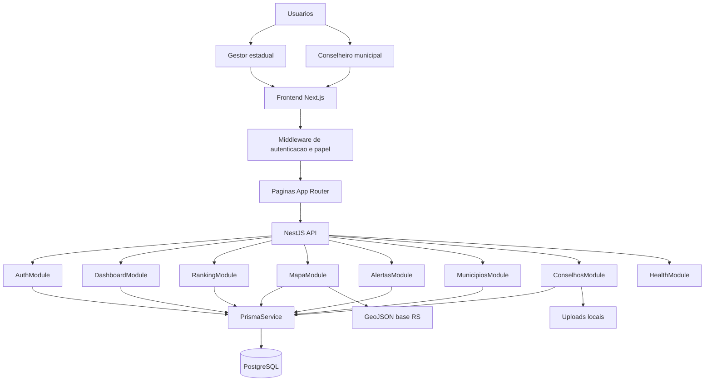
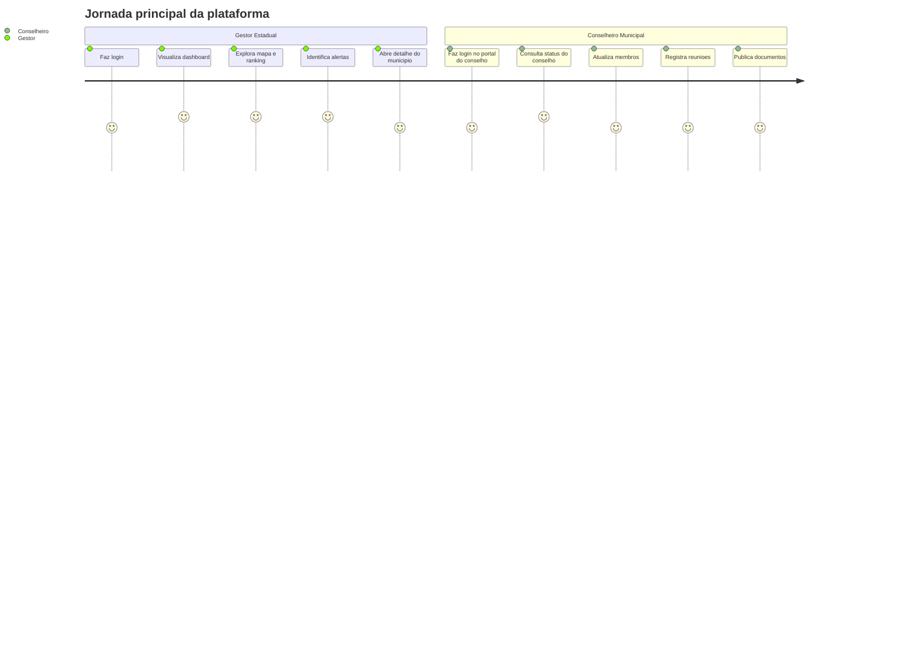
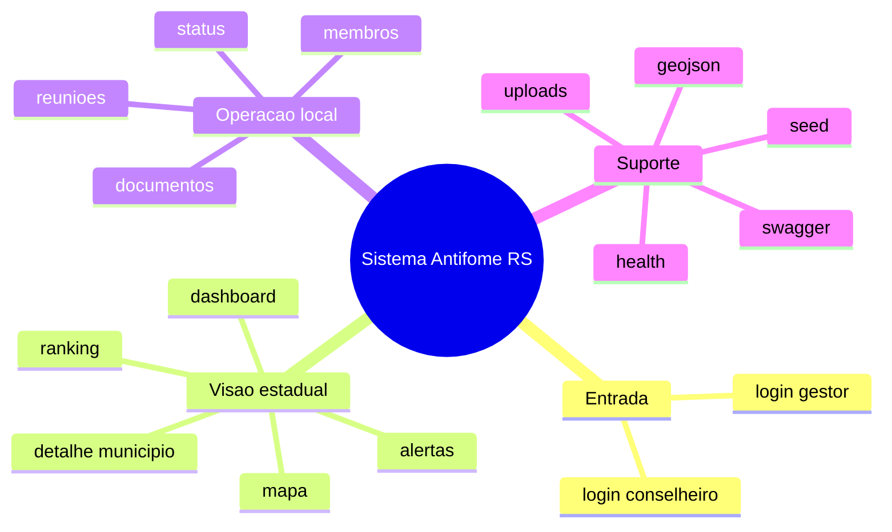

# Plataforma Antifome RS — Arquitetura do Sistema

**Version:** 1.1.0  
**Last Updated:** 15/03/2026  
**Status:** Implementação atual + direcionamento de hackathon  
**PRD:** [prd-antifome.md](../prd/prd-antifome.md)

---

## Visão do produto

O Antifome RS é uma plataforma de governança para segurança alimentar que conecta:

- monitoramento estadual dos municípios
- operação cotidiana dos conselhos municipais
- visualização territorial no mapa do RS
- evidências de execução, documentos, reuniões e progresso institucional

Em termos de apresentação de hackathon, o sistema resolve um problema concreto de gestão pública:

1. o estado precisa identificar rapidamente municípios em risco institucional
2. o conselho municipal precisa de uma interface simples para operar
3. a banca precisa enxergar dados, fluxo e impacto em poucos minutos

---

## Tese para vencer o hackathon

O projeto fica mais competitivo quando a narrativa técnica e de produto está clara:

- problema público real: insegurança alimentar e baixa capacidade de acompanhamento contínuo
- solução operacional: dashboard estadual + portal do conselho
- solução analítica: ranking, mapa, alertas e histórico
- solução institucional: progresso de SISAN, CAISAN, plano municipal e selos
- solução demonstrável: fluxo completo do login até a atuação do conselheiro

### Diferenciais que a documentação deve evidenciar

- arquitetura coerente entre frontend, backend e banco
- dados modelados com domínio público plausível
- API documentada e navegável
- experiência dual:
  - gestor estadual
  - conselheiro municipal
- narrativa visual forte:
  - mapa
  - ranking
  - alertas
  - simulador de impacto

---

## Visão arquitetural



---

## Arquitetura em linguagem simples

### Frontend

O frontend foi feito em Next.js 14 com App Router. Ele entrega:

- home institucional
- login do gestor
- dashboard estadual protegido
- portal do conselho
- páginas de exploração como ranking, mapa, alertas e simulador

### Backend

O backend foi feito em NestJS com organização por módulos de domínio. Cada controller expõe uma área de negócio e cada service concentra a regra correspondente.

### Banco

O banco usa PostgreSQL via Prisma. O schema foi desenhado para refletir o domínio institucional:

- estado
- município
- conselho
- membro
- reunião
- relatório
- selo
- usuário
- documento

---

## Contextos funcionais

### 1. Gestão estadual

Esse contexto concentra a visão macro do estado:

- KPIs do dashboard
- mapa do RS com status e índice
- ranking de municípios
- alertas de inatividade
- consulta detalhada de município
- página institucional de gestão CONSEA

### 2. Operação do conselho municipal

Esse contexto concentra a operação local:

- login dedicado do conselheiro
- acesso ao próprio conselho
- cadastro e edição de membros
- registro de reuniões
- consulta do status institucional
- upload e remoção de documentos

### 3. Infraestrutura e suporte

- autenticação
- health check
- Swagger
- seed
- geração de GeoJSON
- upload local

---

## Personas e jornada



---

## Estrutura do monorepo

Hoje o projeto está organizado como monorepo `pnpm` com três camadas principais:

```text
.
├── backend/
├── frontend/
├── docs/
└── package.json
```

### Papel de cada diretório

| Diretório | Papel |
|---|---|
| `frontend/` | aplicação Next.js |
| `backend/` | API NestJS + Prisma |
| `docs/` | PRD, stories, QA e arquitetura |

### Scripts de topo

O root [package.json](/home/mestredoblack/teste/package.json) padroniza:

- `pnpm dev`
- `pnpm build`
- `pnpm lint`
- `pnpm typecheck`
- `pnpm test`
- `pnpm db:*`

---

## Componentes arquiteturais

## Frontend

### Blocos principais

- App Router
- middleware de autenticação
- providers globais
- contexto de autenticação
- páginas agrupadas por contexto
- componentes de UI e de domínio

### Route groups mais importantes

- `(auth)` para login público
- `(dashboard)` para área estadual
- `conselho/` para portal do conselheiro

## Backend

### Blocos principais

- bootstrap HTTP
- módulos Nest
- guard JWT
- Prisma service
- GeoJSON base + cache
- uploads locais

## Dados

### Entidades centrais

- `Estado`
- `Municipio`
- `Conselho`
- `Membro`
- `Reuniao`
- `RelatorioFome`
- `Selo`
- `Usuario`
- `Documento`

---

## Fluxos essenciais do sistema



---

## Decisões arquiteturais e racional

## Por que Next.js

- permite App Router e layouts claros por área
- facilita demonstração rápida com boa experiência visual
- combina bem com páginas públicas e protegidas

## Por que NestJS

- força modularidade e clareza
- deixa a API apresentável para banca técnica
- integra facilmente com Swagger

## Por que Prisma

- modelagem fortemente tipada
- boa leitura do domínio
- simplifica seed e evolução do schema

## Por que PostgreSQL

- banco relacional adequado ao domínio institucional
- fácil de explicar e operar
- combina com Prisma e com futuras expansões

## Por que cookie HTTP-only para sessão

- simples para fluxo web
- reduz exposição do token no browser
- facilita integração direta do frontend com `credentials: "include"`

---

## Qualidade arquitetural

## Pontos fortes atuais

- separação razoável entre domínio estadual e domínio do conselho
- modelo de dados coerente com a narrativa do produto
- documentação da API já navegável
- seed e dados suficientes para demo rica
- mapa e ranking ajudam muito na percepção de valor

## Limitações atuais

- autorização por papel ainda depende muito do frontend
- alguns cálculos são heurísticos ou simulados
- uploads ainda são locais
- parte da experiência de frontend ainda precisa estabilização
- documentação antiga ainda descrevia módulos que não existem mais literalmente

---

## Riscos técnicos que a banca pode perceber

| Risco | Como explicar |
|---|---|
| regras de progresso são heurísticas | apresentar como MVP validável para iteração posterior |
| autenticação está focada em web | posicionar como arquitetura adequada para demo funcional rápida |
| uploads locais | explicar como estágio inicial antes de storage externo |
| alguns dados são simulados | enfatizar seed plausível e arquitetura pronta para dados reais |

---

## Estratégia de demo

Para a demo funcionar bem, a apresentação deve seguir esta ordem:

1. mostrar o problema e a visão geral
2. entrar como gestor estadual
3. abrir dashboard
4. mostrar ranking e mapa
5. mostrar alertas
6. abrir detalhe de município
7. trocar para o portal do conselheiro
8. atualizar membros, reuniões e documentos
9. mostrar o status institucional e o simulador

Essa ordem faz a banca perceber:

- escala
- operação
- inteligência
- impacto

---

## Leitura recomendada

Para entendimento completo do sistema:

1. [README.md](/home/mestredoblack/teste/docs/architecture/README.md)
2. [api-architecture.md](/home/mestredoblack/teste/docs/architecture/api-architecture.md)
3. [frontend-architecture.md](/home/mestredoblack/teste/docs/architecture/frontend-architecture.md)
4. [data-model.md](/home/mestredoblack/teste/docs/architecture/data-model.md)
5. [api-flows.md](/home/mestredoblack/teste/docs/architecture/api-flows.md)
6. [api-spec.md](/home/mestredoblack/teste/docs/architecture/api-spec.md)
