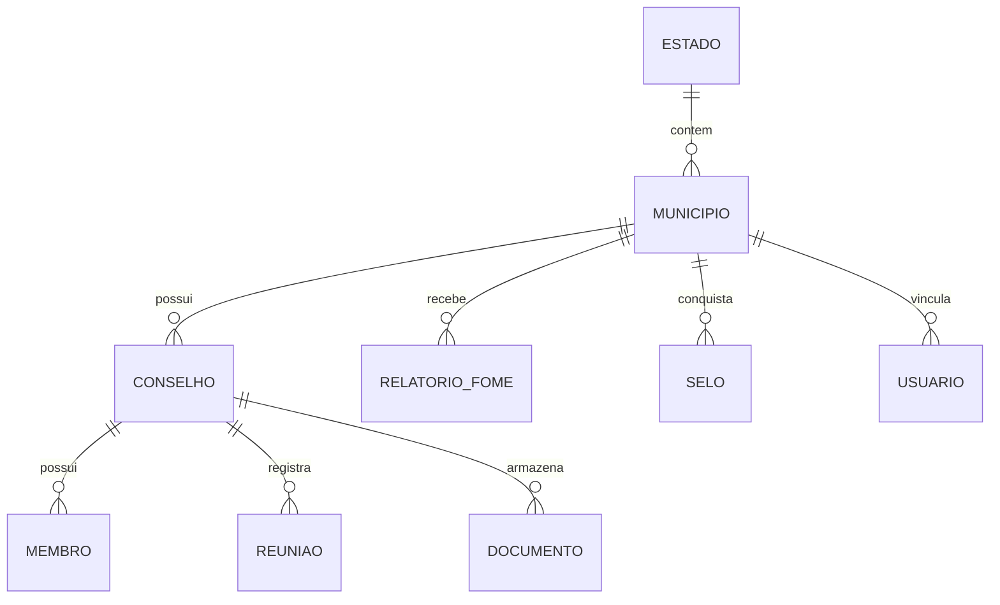
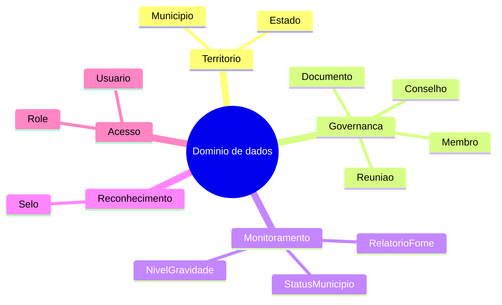

# Plataforma Antifome RS — Modelo de Dados

**Version:** 1.1.0  
**Last Updated:** 15/03/2026  
**Status:** Alinhado ao schema Prisma atual  
**Schema:** [backend/prisma/schema.prisma](/home/mestredoblack/teste/backend/prisma/schema.prisma)

---

## Visão geral

O modelo de dados do Antifome RS foi desenhado para representar duas dimensões ao mesmo tempo:

- a estrutura institucional dos conselhos e municípios
- a visão analítica que sustenta dashboard, ranking, alertas e mapa

Ele é compacto o suficiente para um MVP de hackathon, mas já organiza o domínio de forma crível para expansão futura.

---

## Princípios do modelo

### 1. Município como centro operacional

O município é a unidade principal da aplicação. Quase tudo converge para ele:

- conselho
- relatórios de fome
- selos
- usuários vinculados
- status institucional

### 2. Conselho como unidade de governança local

O conselho representa a capacidade institucional do município de operar a política pública.

### 3. Usuário como chave de acesso, não como centro de domínio

O usuário serve para autenticação e autorização de contexto. O domínio principal continua sendo município e conselho.

### 4. Dados mistos: persistidos e derivados

Parte da plataforma vem de dados persistidos em tabelas. Outra parte é derivada por regras em services.

Exemplos:

- persistido: reuniões, documentos, membros
- derivado: progresso de selo, recomendações, histórico sintético de índice

---

## Diagrama ER do modelo atual

---

## Entidades principais

## Estado

Representa a unidade federativa. Hoje o sistema está focado no RS, mas o modelo já suporta expansão.

### Campos principais

- `id`
- `nome`
- `sigla`
- `created_at`
- `updated_at`

### Papel no sistema

- agrupar municípios
- permitir futura expansão para múltiplos estados

---

## Municipio

É a entidade central do sistema.

### Campos principais

- `codigo_ibge`
- `nome`
- `estado_id`
- `populacao`
- `indice_antifome`
- `status`
- `latitude`
- `longitude`

### Papel no sistema

- servir de base para ranking
- alimentar o mapa
- concentrar os dados de vulnerabilidade e governança
- vincular conselho, relatórios, selos e usuários

### Índices definidos

- por `estado_id`
- por `status`
- por combinação `estado_id + status`

Esses índices ajudam leituras frequentes em dashboards, filtros e ranking.

---

## Conselho

Representa a instância institucional local de segurança alimentar.

### Campos principais

- `municipio_id`
- `nome`
- `status`
- `created_at`
- `updated_at`

### Papel no sistema

- ser a base do portal do conselheiro
- organizar membros, reuniões e documentos
- refletir capacidade institucional do município

### Status

- `ATIVO`
- `INATIVO`
- `SUSPENSO`

---

## Membro

Representa um integrante do conselho.

### Campos principais

- `conselho_id`
- `nome`
- `cargo`
- `email`
- `telefone`

### Papel no sistema

- permitir o cadastro da composição do conselho
- sustentar métricas de governança e progresso institucional

### Cargo

- `PRESIDENTE`
- `VICE`
- `MEMBRO`

---

## Reuniao

Representa o registro de uma reunião do conselho.

### Campos principais

- `conselho_id`
- `data`
- `tipo`
- `pauta`
- `ata_url`

### Papel no sistema

- medir atividade do conselho
- alimentar estatísticas e status
- sustentar alertas de inatividade

### Tipo

- `ORDINARIA`
- `EXTRAORDINARIA`

---

## RelatorioFome

Representa a evidência de acompanhamento da insegurança alimentar.

### Campos principais

- `municipio_id`
- `mes_ano`
- `nivel_gravidade`
- `dados_json`

### Papel no sistema

- servir como insumo para leitura de regularidade do município
- alimentar parte dos alertas
- sustentar parte do status institucional do conselho

### Observação

O campo `dados_json` permite armazenar estrutura flexível sem expandir o schema no MVP.

---

## Selo

Representa marcos de reconhecimento institucional do município.

### Campos principais

- `municipio_id`
- `tipo`
- `conquistado_em`

### Papel no sistema

- enriquecer ranking
- sustentar narrativa de gamificação institucional
- mostrar evolução do município

### Tipos

- `BRONZE`
- `PRATA`
- `OURO`
- `PLATINA`

---

## Usuario

Representa a credencial de acesso ao sistema.

### Campos principais

- `email`
- `senha_hash`
- `role`
- `municipio_id`

### Papel no sistema

- autenticar o usuário
- vincular conselheiros a municípios específicos
- diferenciar acesso estadual de acesso municipal

### Roles

- `ADMIN`
- `GESTOR_ESTADUAL`
- `CONSELHEIRO_MUNICIPAL`

### Observação

O vínculo com `municipio_id` é opcional porque gestores estaduais não precisam estar associados a um município.

---

## Documento

Representa um arquivo institucional do conselho.

### Campos principais

- `conselho_id`
- `nome`
- `categoria`
- `descricao`
- `arquivo_url`
- `arquivo_tipo`
- `arquivo_tamanho`
- `criado_por`

### Papel no sistema

- armazenar documentos do conselho
- dar evidência institucional à banca
- permitir demo prática de upload e consulta

---

## Enums do domínio

## StatusMunicipio

- `ATIVO`
- `INATIVO`
- `ATRASADO`

### Interpretação prática

- `ATIVO`: boa situação institucional relativa
- `ATRASADO`: sinais de fragilidade ou atraso
- `INATIVO`: baixa atividade institucional

## StatusConselho

- `ATIVO`
- `INATIVO`
- `SUSPENSO`

## NivelGravidade

- `BAIXO`
- `MODERADO`
- `ALTO`
- `CRITICO`

### Uso

Hoje está ligado principalmente aos relatórios de fome.

---

## Relacionamentos explicados

### Estado -> Municípios

Um estado possui muitos municípios.

### Município -> Conselhos

Um município pode ter mais de um conselho ao longo do tempo no modelo, mas na prática a operação busca o conselho ativo do município.

### Conselho -> Membros / Reuniões / Documentos

Essas três entidades descrevem a vida operacional do conselho.

### Município -> Relatórios / Selos / Usuários

- relatórios: evidências de monitoramento
- selos: reconhecimento institucional
- usuários: vínculo de autenticação e contexto

---

## O que é persistido e o que é calculado

| Item | Persistido? | Onde nasce |
|---|---|---|
| usuários | sim | tabela `usuarios` |
| documentos | sim | tabela `documentos` |
| reuniões | sim | tabela `reunioes` |
| membros | sim | tabela `membros` |
| status do conselho | sim | tabela `conselhos` |
| progresso de selo | não | `ConselhosService` |
| recomendações | não | `ConselhosService` |
| série histórica do índice | não | `MunicipiosService` |
| alertas combinados | não | `AlertasService` |

Essa distinção é importante para a banca entender o que já é infraestrutura de dados e o que ainda é inteligência derivada do MVP.

---

## Como o modelo sustenta cada tela

## Dashboard

Usa principalmente:

- `municipios`
- `conselhos`
- `reunioes`
- `selos`

## Ranking

Usa principalmente:

- `municipios`
- `selos`

## Mapa

Usa principalmente:

- `municipios`
- GeoJSON base

## Alertas

Usa principalmente:

- `conselhos`
- `reunioes`
- `relatorios_fome`
- `municipios`

## Portal do conselho

Usa principalmente:

- `usuarios`
- `municipios`
- `conselhos`
- `membros`
- `reunioes`
- `documentos`

---

## Seed e plausibilidade de dados

O seed atual cria um cenário de demonstração realista:

- estado RS
- 497 municípios
- distribuição de status
- conselhos
- membros
- reuniões
- relatórios
- selos
- usuários de acesso

Isso é crucial para hackathon, porque permite demo rica sem depender de integração externa.

---

## Limitações do modelo atual

### 1. Não existe trilha de auditoria persistida

O schema atual não possui tabela de auditoria implementada, embora isso seja uma evolução natural.

### 2. Progressos e selos não são tabela de regras

As regras vivem na service, não em metadados persistidos.

### 3. Documentos são locais

O banco guarda metadados, mas o binário fica em disco local.

### 4. Histórico de índice é parcialmente sintético

Bom para demo, mas deve ser substituído por séries reais em produção.

---

## Mapa mental do domínio

---

## Leituras complementares

- [api-architecture.md](/home/mestredoblack/teste/docs/architecture/api-architecture.md)
- [api-spec.md](/home/mestredoblack/teste/docs/architecture/api-spec.md)
- [api-flows.md](/home/mestredoblack/teste/docs/architecture/api-flows.md)
