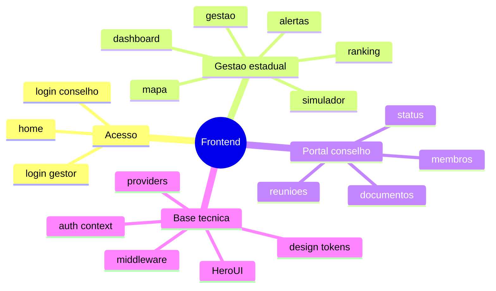

# Plataforma Antifome RS — Arquitetura do Frontend

**Version:** 1.1.0  
**Last Updated:** 15/03/2026  
**Status:** Alinhado ao frontend atual  
**Framework:** Next.js 14 App Router

---

## Visão geral

O frontend do Antifome RS foi desenhado para sustentar dois modos de uso distintos dentro da mesma aplicação:

- visão estadual de monitoramento e decisão
- visão municipal de operação do conselho

Essa separação é uma das forças do projeto para hackathon, porque mostra que o sistema não é só visualização: ele também suporta operação institucional.

---

## Papel do frontend na arquitetura

O frontend é responsável por:

- renderizar a experiência do usuário
- controlar navegação entre áreas públicas e protegidas
- recuperar sessão a partir do backend
- consumir a API NestJS
- traduzir dados institucionais em componentes visuais claros

Ele não é um frontend genérico de CRUD. Ele é a camada de demonstração do valor do produto.

---

## Tecnologias usadas

| Área | Tecnologia | Papel |
|---|---|---|
| framework | Next.js 14 | estrutura da app |
| runtime UI | React 18 | componentes e estado |
| design system | HeroUI | base dos componentes de interface |
| utilitários de estilo | Tailwind CSS | layout e styling |
| ícones | Lucide | iconografia |
| mapa | Leaflet + react-leaflet | visualização territorial |
| validação de form | react-hook-form + zod | login e formulários |
| animação | framer-motion | recursos visuais disponíveis |
| auth auxiliar | jose | validação de JWT no middleware |

---

## Estrutura real de rotas

```text
frontend/src/app
├── page.tsx
├── layout.tsx
├── globals.css
├── (auth)/
│   ├── login/page.tsx
│   └── forgot-password/page.tsx
├── (dashboard)/
│   ├── layout.tsx
│   ├── dashboard/page.tsx
│   ├── alertas/page.tsx
│   ├── gestao/page.tsx
│   ├── mapa/page.tsx
│   ├── ranking/page.tsx
│   ├── simulador/page.tsx
│   └── design-system/page.tsx
└── conselho/
    ├── layout.tsx
    ├── page.tsx
    ├── login/page.tsx
    ├── membros/page.tsx
    ├── reunioes/page.tsx
    ├── status/page.tsx
    └── documentos/page.tsx
```

---

## Organização por contexto

## Área pública

### Rotas

- `/`
- `/login`
- `/forgot-password`
- `/conselho/login`

### Papel

- apresentar a plataforma
- permitir autenticação de gestor
- permitir autenticação de conselheiro

## Área estadual

### Rotas

- `/dashboard`
- `/ranking`
- `/mapa`
- `/alertas`
- `/gestao`
- `/simulador`

### Papel

- apresentar o panorama do estado
- servir de demo principal para a banca
- apoiar decisão e monitoramento

## Área do conselho

### Rotas

- `/conselho`
- `/conselho/status`
- `/conselho/membros`
- `/conselho/reunioes`
- `/conselho/documentos`

### Papel

- permitir operação cotidiana do conselho
- comprovar valor além da camada analítica

---

## Arquitetura de layout

```mermaid
flowchart TD
    Root[app/layout.tsx]
    Root --> Providers[AppProviders]
    Root --> Public[rotas publicas]
    Root --> Dashboard[(dashboard)/layout.tsx]
    Root --> Conselho[conselho/layout.tsx]

    Dashboard --> Sidebar[Sidebar]
    Dashboard --> Header[Header]
    Dashboard --> AuthContext[AuthProvider + useAuth]

    Conselho --> PortalShell[layout do portal]
    Conselho --> ConselhoFetch[fetch de /api/auth/me e /api/conselhos/mine]
```

---

## Providers globais

O arquivo [app-providers.tsx](/home/mestredoblack/teste/frontend/src/components/providers/app-providers.tsx) empacota:

- `HeroUIProvider`
- `ToastProvider`

### Resultado

- base visual consistente
- sistema global de toasts
- ponto único para evoluir providers futuros

---

## Middleware e proteção de rotas

O [middleware.ts](/home/mestredoblack/teste/frontend/src/middleware.ts) faz:

- liberação de rotas públicas
- leitura do cookie `access_token`
- validação do JWT com `jose`
- redirecionamento para `/login` quando necessário
- separação macro entre área estadual e área do conselho

### Regras principais

- rotas `/conselho*` exigem conselheiro
- rotas `/dashboard`, `/mapa`, `/ranking`, `/alertas`, `/gestao`, `/simulador` exigem papel estadual

### Importância para demo

Essa camada deixa clara a separação de perfis sem obrigar o usuário a entender a API.

---

## Estado de autenticação no client

O [auth-context.tsx](/home/mestredoblack/teste/frontend/src/contexts/auth-context.tsx) centraliza:

- usuário atual
- loading de sessão
- login
- logout

### Fluxo

1. ao montar, busca `/api/auth/me`
2. se houver sessão válida, preenche `usuario`
3. páginas protegidas usam esse estado

### Benefício

Evita que cada tela replique a lógica de sessão.

---

## Consumo de API

O frontend consome a API de duas maneiras:

### 1. Via URL absoluta do backend

Exemplo:

- `${process.env.NEXT_PUBLIC_API_URL}/api/dashboard/stats`

### 2. Via rewrite do Next

O [next.config.js](/home/mestredoblack/teste/frontend/next.config.js) reescreve:

- `/api/:path*` -> `http://localhost:3001/api/:path*`

### Quando isso importa

- área do conselho usa bastante o rewrite local
- páginas do dashboard ainda usam bastante `NEXT_PUBLIC_API_URL`

---

## Componentização

## Componentes de layout

- [sidebar.tsx](/home/mestredoblack/teste/frontend/src/components/layout/sidebar.tsx)
- [header.tsx](/home/mestredoblack/teste/frontend/src/components/layout/header.tsx)
- [page-transition.tsx](/home/mestredoblack/teste/frontend/src/components/layout/page-transition.tsx)

### Papel

- navegação
- consistência visual
- shell da aplicação

## Componentes de dashboard

- [kpi-bar.tsx](/home/mestredoblack/teste/frontend/src/components/dashboard/kpi-bar.tsx)
- [kpi-card.tsx](/home/mestredoblack/teste/frontend/src/components/dashboard/kpi-card.tsx)

### Papel

- materializar dados do dashboard em leitura rápida
- reforçar valor logo na entrada do gestor

## Componentes do mapa

- [map-container.tsx](/home/mestredoblack/teste/frontend/src/components/map/map-container.tsx)
- [map-legend.tsx](/home/mestredoblack/teste/frontend/src/components/map/map-legend.tsx)
- layers:
  - `base-layer`
  - `iag-layer`
  - `cozinhas-layer`
  - `ppsan-layer`

### Papel

- traduzir os dados territoriais em visualização forte para banca

## Componentes do conselho

- `status-dashboard`
- `seal-progress`
- `meeting-card`
- `meeting-timeline`
- `recommendations`
- `sisan-card`
- `caisan-card`
- `plano-card`

### Papel

- transformar governança municipal em linguagem visual

## Componentes de UI

Os componentes em `components/ui` são wrappers do HeroUI adaptados ao design tokens do projeto.

Exemplos:

- button
- card
- badge
- input
- dialog
- skeleton
- toast

---

## Design tokens e identidade visual

O frontend usa dois pilares para identidade:

- [globals.css](/home/mestredoblack/teste/frontend/src/app/globals.css)
- [tailwind.config.ts](/home/mestredoblack/teste/frontend/tailwind.config.ts)

### Direção visual

- verde institucional para governo e segurança alimentar
- vermelho de urgência para alertas e foco
- fundo claro e painéis limpos
- grid sutil para densidade visual

### Fontes

Hoje o layout usa variáveis CSS e fallback local, sem depender de `next/font/google`, o que reduz fragilidade em ambiente restrito.

---

## Como cada tela conversa com a API

| Tela | Endpoint principal |
|---|---|
| `/dashboard` | `/api/dashboard/stats` |
| `/ranking` | `/api/ranking` |
| `/mapa` | `/api/mapa/geojson` |
| `/alertas` | `/api/alertas` |
| `/conselho` | `/api/conselhos/mine/stats` |
| `/conselho/status` | `/api/conselhos/mine/status` |
| `/conselho/membros` | `/api/conselhos/mine`, `/api/conselhos/:id/membros` |
| `/conselho/reunioes` | `/api/conselhos/mine`, `/api/conselhos/:id/reunioes` |
| `/conselho/documentos` | `/api/conselhos/mine/documentos` |

---

## Estratégia de UX para hackathon

O frontend está organizado para causar impacto em três níveis:

### 1. Entendimento instantâneo

Quando o gestor entra, ele vê:

- KPIs
- rotas claras
- páginas com nomenclatura institucional

### 2. Prova visual

O mapa, o ranking e os alertas mostram que existe inteligência e monitoramento.

### 3. Prova operacional

O portal do conselho mostra que existe uso real da ferramenta, não só dashboard.

---

## Pontos fortes do frontend

- separação boa entre área estadual e área municipal
- base visual institucional consistente
- componentes específicos de domínio
- mapa como peça de demonstração forte
- middleware de proteção para orientar navegação

---

## Pontos a evoluir

- consolidar a camada de consumo da API em um cliente único
- reduzir mistura entre rewrite `/api` e URL absoluta
- estabilizar completamente navegação e algumas telas em dev
- adicionar testes E2E confiáveis para os fluxos críticos

---

## Mapa mental do frontend



---

## Referências principais

- Root layout: [layout.tsx](/home/mestredoblack/teste/frontend/src/app/layout.tsx)
- Middleware: [middleware.ts](/home/mestredoblack/teste/frontend/src/middleware.ts)
- Auth context: [auth-context.tsx](/home/mestredoblack/teste/frontend/src/contexts/auth-context.tsx)
- Sidebar: [sidebar.tsx](/home/mestredoblack/teste/frontend/src/components/layout/sidebar.tsx)
- Header: [header.tsx](/home/mestredoblack/teste/frontend/src/components/layout/header.tsx)
- Mapa: [map-container.tsx](/home/mestredoblack/teste/frontend/src/components/map/map-container.tsx)
