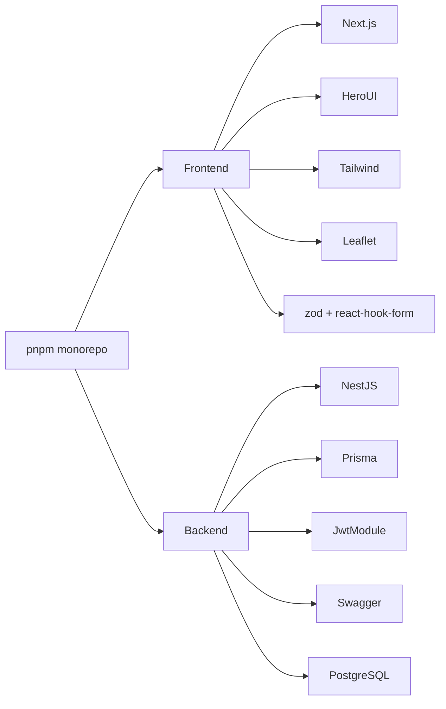

# Plataforma Antifome RS — Pilha Tecnológica

**Version:** 1.1.0  
**Last Updated:** 15/03/2026  
**Status:** Atualizada para o monorepo real

---

## Resumo executivo

A stack do Antifome RS foi escolhida para equilibrar quatro exigências do hackathon:

- velocidade de implementação
- clareza arquitetural
- boa capacidade de demonstração
- base suficientemente séria para continuação depois da banca

---

## Stack consolidada

| Camada | Tecnologia | Papel no projeto |
|---|---|---|
| monorepo | `pnpm` | padronização e orquestração do workspace |
| frontend | Next.js 14 | aplicação web principal |
| UI | HeroUI + Tailwind CSS | base visual e componentes |
| backend | NestJS 10 | API modular |
| ORM | Prisma | acesso ao banco e modelagem |
| banco | PostgreSQL | persistência relacional |
| autenticação | JWT | sessão autenticada |
| sessão web | cookie HTTP-only | transporte do token |
| mapa | Leaflet + react-leaflet | visualização territorial |
| validação de forms | zod + react-hook-form | formulários do frontend |
| docs visuais | Swagger | apresentação da API |
| testes navegação | Playwright | validação E2E |

---

## Monorepo e package management

O projeto usa `pnpm` como padrão oficial.

### Motivo

- melhor aderência a monorepo
- instalação mais eficiente
- padronização entre frontend e backend
- facilidade de scripts na raiz

### Evidência no repositório

O root [package.json](/home/mestredoblack/teste/package.json) define:

- `packageManager: "pnpm@10.28.2"`
- `preinstall` que bloqueia uso de `npm`

### Scripts mais importantes

```bash
pnpm dev
pnpm build
pnpm lint
pnpm typecheck
pnpm test
pnpm db:generate
pnpm db:migrate
pnpm db:seed
```

---

## Frontend

## Next.js 14

### Por que foi escolhido

- App Router simplifica organização por contexto
- layouts aninhados ajudam a separar área estadual e portal do conselho
- ótima narrativa para banca técnica
- fácil integração com middleware e rotas protegidas

### Onde aparece

- [frontend/package.json](/home/mestredoblack/teste/frontend/package.json)
- [frontend/src/app](/home/mestredoblack/teste/frontend/src/app)

## React 18

### Papel

- base da composição de componentes
- estado local e hooks
- renderização de páginas client-side e híbridas

## HeroUI

### Papel

- fornece base dos componentes visuais
- acelera criação de botões, cards, inputs, badges e toasts

### Motivo para hackathon

- reduz tempo de construção visual
- mantém aparência mais consistente do que componentes soltos

## Tailwind CSS

### Papel

- layout
- responsividade
- tokens visuais
- customização rápida

### Motivo

- velocidade
- previsibilidade
- boa compatibilidade com HeroUI

## Leaflet + react-leaflet

### Papel

- motor da visualização geográfica do RS

### Motivo

- open source
- sem dependência de API paga
- suficiente para mapa interativo de demo

---

## Backend

## NestJS 10

### Por que foi escolhido

- organização modular muito clara
- padrão profissional para banca
- controllers e services deixam o domínio explicável
- integração nativa com Swagger e pipes

### Módulos atuais

- auth
- municipios
- conselhos
- dashboard
- mapa
- ranking
- alertas
- health

## Prisma

### Papel

- modelagem do banco
- client tipado
- seed e evolução do schema

### Benefício para hackathon

- reduz atrito de banco
- melhora clareza do domínio
- facilita documentação do modelo

## PostgreSQL

### Papel

- persistência relacional do domínio

### Motivo

- adequado para dados institucionais
- robusto e conhecido
- encaixa bem com Prisma

---

## Autenticação e segurança

## JWT

### Papel

- carregar identidade do usuário autenticado
- transportar `sub`, `email`, `role` e `municipioId`

## Cookie HTTP-only

### Papel

- guardar a sessão do cliente web

### Motivo

- simples para integração browser + API
- reduz manipulação manual de token no frontend

## Helmet

### Papel

- hardening de headers HTTP

## Compression

### Papel

- reduzir payloads de resposta

## ValidationPipe

### Papel

- garantir saneamento e transformação dos dados de entrada

---

## Developer experience

## TypeScript

Está presente em:

- frontend
- backend
- scripts
- Prisma client usage

### Valor

- clareza
- segurança em refactor
- melhor comunicação entre camadas

## Swagger

### Papel

- documentação visual da API
- exploração rápida de endpoints
- apoio em demo técnica

## Playwright

### Papel

- testar fluxos reais de navegação
- reproduzir problemas de login e acesso

---

## Scripts e ferramentas auxiliares

## Seed

- [backend/prisma/seed.ts](/home/mestredoblack/teste/backend/prisma/seed.ts)

### Papel

- popular o banco com cenário plausível
- permitir demo rica

## Geração de GeoJSON

- [backend/scripts/gerar-geojson.ts](/home/mestredoblack/teste/backend/scripts/gerar-geojson.ts)

### Papel

- construir base territorial do mapa

## Criação de usuário

- [backend/scripts/create-user.ts](/home/mestredoblack/teste/backend/scripts/create-user.ts)

### Papel

- facilitar provisão de acessos demo

---

## Dependências por contexto



---

## Por que essa stack faz sentido para a banca

### Clareza

A banca consegue reconhecer rapidamente uma arquitetura moderna e defensável.

### Coerência

Frontend, backend e banco conversam bem entre si.

### Viabilidade

Nada aqui depende de infraestrutura exótica ou de ferramenta difícil de operar.

### Evolução

É uma base plausível para seguir depois do hackathon.

---

## Trade-offs assumidos

| Escolha | Benefício | Trade-off |
|---|---|---|
| cookie HTTP-only | simples para web | menos amigável para clientes externos puros |
| uploads locais | implementação rápida | não ideal para produção |
| HeroUI + Tailwind | velocidade visual | camada de abstração a mais |
| regras em services | agilidade no MVP | menos configurável via banco |
| dados seeded | demo forte | parte do cenário ainda é sintético |

---

## Comandos de referência

### Monorepo

```bash
pnpm install
pnpm dev
pnpm build
pnpm lint
pnpm typecheck
pnpm test
```

### Banco

```bash
pnpm db:generate
pnpm db:migrate
pnpm db:seed
pnpm db:studio
```

### Backend

```bash
pnpm --filter antifome-rs-backend start:dev
pnpm --filter antifome-rs-backend build
```

### Frontend

```bash
pnpm --filter antifome-rs-frontend dev
pnpm --filter antifome-rs-frontend build
```

---

## Conclusão

A stack do Antifome RS não foi escolhida só por familiaridade. Ela foi escolhida porque ajuda a entregar:

- boa demo
- boa explicação
- boa evolução

Para hackathon, isso importa mais do que uma stack excessivamente sofisticada.
